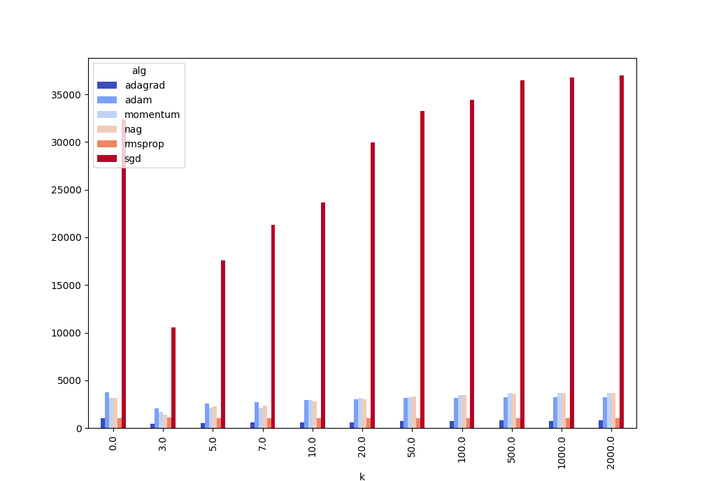

UDC 519.688

# Investigating convergence rate of stochastic finite-difference optimization methods

V. I. Norkin (1), A. Y. Kozyriev (1)

[1 - Igor Sikorsky Kyiv Polytechnic Institute, Kyiv, Ukraine](https://kpi.ua/en)

## Abstract

Nowadays, stochastic gradient algorithms have become one of the most popular numerical optimization methods due to their efficiency and formulation simplicity. They are used in a variety of areas: from cost reduction problems to deep learning. The common feature of all these problems is to find the optimal values for a set of independent parameters in a mathematical model that can be described by a set of equalities and inequalities. The number of computing resources and time spent to solve the problem, the accuracy of the mathematical model, etc. depends on how effective the chosen gradient descent algorithm is. In practice, stochastic gradient algorithms only show fair results for convex and smooth functions. However, most modern optimization problems do not belong to these classes (for instance, a deep neural network with a ReLU activation function is a non-smooth optimization problem). The article proposes a new modification to the existing stochastic gradient algorithms based on an averaged functions smoothing technique and finite-difference approximations with more robustness to the non-smooth target functions.

## Keywords

Gradient descent methods, optimization theory, unconstrained optimization, nonsmooth problems, stochastic gradient descent methods, adaptive gradient descent methods, finite difference methods.

## Results

The proposed finite-difference modification applies to any stochastic gradient descent algorithms because it requires only a substitution of analytical gradient value with its approximation. Therefore, we preserve the properties and benefits when applying the modification for the arbitrary adaptive stochastic gradient algorithm. As shown in the figure below, we significantly decreased the number of iterations for a small number of smoothing terms.

## References

1. NEWTON, David, Farzad YOUSEFIAN, and Raghu PASUPATHY. Stochastic gradient descent: recent trends. Online. In: Recent advances in optimization and modeling of contemporary problems, pp. 1–2. INFORMS, 2018. ISBN 9780990615323. Available from: https://doi.org/10.1287/educ.2018.0191. [viewed 2021-11-11].
2. ILYIN, Vladimir, and Eduard POZNYAK. Fundamentals of mathematical analysis. In: The course of calculus and mathematical physics, p. 644. Moscow: Fizmatlit, 2009. ISBN 5922105361.
3. ZORICH, Vladimir. Basic theorems of differential calculus. In: Calculus, part 1, p. 215. Moscow: FASIS, 1997. ISBN 5703600316.
4. PIRUMOV, Ulyan. Function approximation. Numerical integration and differentiation. In: Numerical methods, pp. 78–79. Moscow: MAI, 1998. ISBN 5703521904.
5. BAYANDINA, A. S., A. V. GASNIKOV, and A. A. LAGUNOVSKAYA. Gradient-Free two-point methods for solving stochastic nonsmooth convex optimization problems with small non-random noises. Online. Automation and Remote Control, vol. 79 (August 2018), no. 8, pp. 1399–1408. ISSN 1608-3032. Available from: https://doi.org/10.1134/s0005117918080039. [viewed 2022-01-04].
6. DUCHI, John C., Michael I. JORDAN, Martin J. WAINWRIGHT, and Andre WIBISONO. Optimal rates for zero-order convex optimization: the power of two function evaluations. Online. IEEE Transactions on Information Theory, vol. 61 (May 2015), no. 5, pp. 2788–2806. ISSN 1557-9654. Available from: https://doi.org/10.1109/tit.2015.2409256. [viewed 2022-03-06].
7. NORKIN, Vladimir. A stochastic smoothing method for nonsmooth global optimization. Online. Cybernetics and Computer Technologies, March 2020, no. 1, pp. 5–14. ISSN 2707-451X. Available from: https://doi.org/10.34229/2707-451x.20.1.1. [viewed 2022-03-09].
8. ATTETKOV, Alexander, Vladimir ZARUBIN, and Anatoly KANATNIKOV. Multidimensional unconstrained optimization. In: Introduction to optimization methods, pp. 49–54. Moscow: INFRA-M, 2008. ISBN 9785279032518.
9. QIAN, Ning. On the momentum term in gradient descent learning algorithms. Online. Neural Networks, vol. 12 (January 1999), no. 1, pp. 145–151. ISSN 0893-6080. Available from: https://doi.org/10.1016/s0893-6080(98)00116-6. [viewed 2022-03-15].
10. NESTEROV, Yurii. A method of solving a convex programming problem with convergence rate 0(1/k2). Dokl. Akad. Nauk SSSR, vol. 269 (1983), no. 27, pp. 543–547.
11. WALKINGTON, Noel. Nesterov method for convex optimization. SIAM Journal on Numerical Analysis, 2021, pp. 9–11.
12. DUCHI, John, Elad HAZAN, and Yoram SINGER. Adaptive Subgradient Methods for Online Learning and Stochastic Optimization. Journal of Machine Learning Research, vol. 12 (2011), pp. 1–3.
